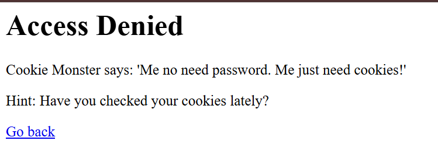

# picoCTF 2025 - Cookie Monster Secret Recipe

**Category** Web Exploitation

> Đề bài: Cookie Monster has hidden his top-secret cookie recipe somewhere on his website. As an aspiring cookie detective, your mission is to uncover this delectable secret. Can you outsmart Cookie Monster and find the hidden recipe?
>You can access the Cookie Monster here and good luck
> Link: http://verbal-sleep.picoctf.net:53631/

Trang web hiện ra 1 trang login cơ bản.

Thử nhập `test/test` vào ô `Username` và `Password`.

🙃 Access Denied!

Tuy nhiên tác sau khi nhấn `login` tác giả dẫn ta đến 1 trang web khác - nơi có gợi ý kiểm tra Cookies. => Hệ thống có thể đang lưu trữ thông tin xác thực hoặc dữ liệu nhạy cảm ở phía Client(Trình duyệt).


Vào `DevTools(F12)` -> `Application` -> `Cookies`.

Tại đây có 1 Cookie khá đáng ngờ : 

`Name`  : `secret_recipe`

`Value` : `cGljb0NURntjMDBrMWVfbTBuc3Rlcl9sMHZlc19jMDBraWVzX0E2RkEwN0Q4fQ%3D%3D`

Chuỗi ký tự này chỉ bao gồm các ký tự chữ cái, số và kết thúc bằng `%3D%3D`. => Dạng `URL Encode` của dấu `==` => Dấu hiệu đặc trưng của `Base64Padding`.

Do đó đây là 1 chuỗi `base64` đã được `URL Encoded`.

Để lấy `flag` ta cần decode giá trị này. Có 2 cách thực hiện :

## Cách 1 : Sử dụng công cụ Online (CyberChef).
Copy giá trị vào CyberChef và sử dụng recipe: `URL Decode` -> `From Base64`.

## Cách 2 : Sử dụng Linux Terminal
Nếu đang dùng Linux hoặc WSL có thể decode bằng lệnh : 

``` bash
# %3D%3D tương đương ==, ta có thể decode trực tiếp chuỗi gốc
echo "cGljb0NURntjMDBrMWVfbTBuc3Rlcl9sMHZlc19jMDBraWVzX0E2RkEwN0Q4fQ==" | base64 -d
```

**Kết quả Decode:**🎉picoCTF{c00k1e_m0nster_l0ves_c00kies_A6FA07D8}.

**Flag:** picoCTF{c00k1e_m0nster_l0ves_c00kies_A6FA07D8}

>Bài lab minh họa rủi ro của việc lưu trữ dữ liệu nhạy cảm (như flag hoặc thông tin mật) dưới dạng `Plaintext` hoặc `Encoding` (như Base64) tại `Client-side Cookie`.

>`Encoding` không phải là `Encryption`: `Base64` chỉ là một dạng mã hóa để hiển thị dữ liệu, bất kỳ ai cũng có thể dịch ngược lại được.

>Khắc phục: Dữ liệu nhạy cảm nên được lưu tại Server-side (Session) hoặc được mã hóa (Encryption) và ký (Signed) cẩn thận nếu bắt buộc phải lưu ở Client.

