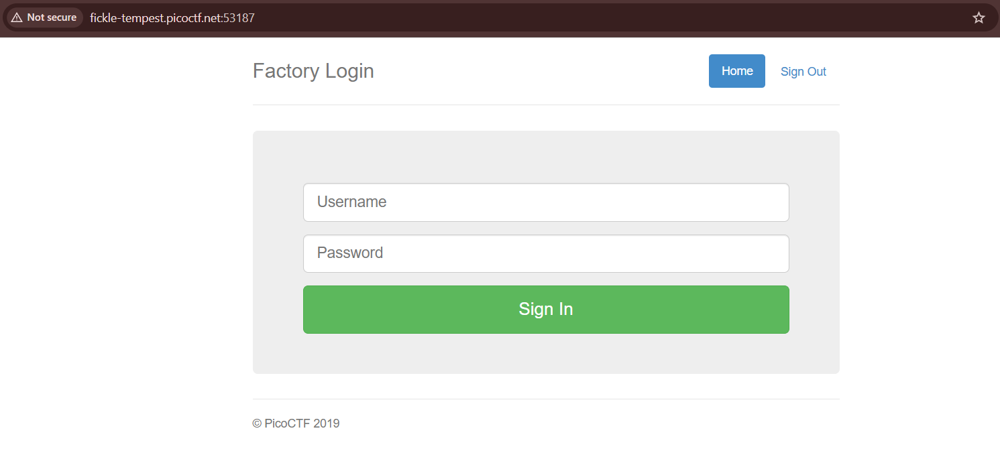
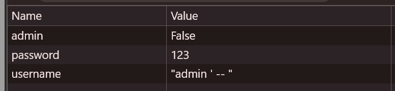
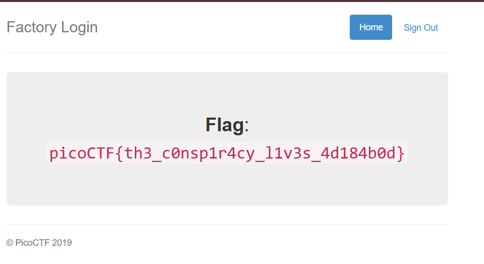

# picoCTF 2019 - logon

**Category** Web Exploitation

## 1. Description

Đề bài :The factory is hiding things from all of its users.
Can you login as Joe and find what they've been looking at?

Link bài lab :http://fickle-tempest.picoctf.net:53187

## 2. Reconnaissance

Đây là giao diện ban đầu của trang web

Trang web hiện ra 1 trong login đơn giản.

Tôi thử đăng nhập với các thông tin ngẫu nhiên như `user: test` / `pass: test`. Kết quả: **Đăng nhập thành công!** Tuy nhiên, trang web hiển thị thông báo: **"No flag for you"**.

Điều này cho thấy trang web không kiểm tra chặt chẽ thông tin đăng nhập (Authentication), mà vấn đề nằm ở việc phân quyền (Authorization) sau khi đăng nhập.

## 3. Vulnerability Analysis

Mặc dù đã đăng nhập được nhưng tôi vẫn chưa thấy Flag. Tôi nghi ngờ hệ thống phân biệt quyền hạn giữa người dùng thường và admin thông qua một cơ chế lưu trữ ở phía Client, ví dụ như Cookies.

## 4. Exploitation

Mở Devtools(F12) -> Application -> Cookies.

Tại đây, cookie `admin` đang có giá trị là `False`. Đây chính là lỗ hổng **Insecure Cookie Handling**: Server tin tưởng giá trị admin do client gửi lên để xác định quyền hạn.

Tôi tiến hành sửa giá trị cookie admin từ `False` thành `True` và tải lại trang (F5).

**Kết quả:**

## 5. Result

**Flag:**picoCTF{th3_c0nsp1r4cy_l1v3s_4d184b0d}
