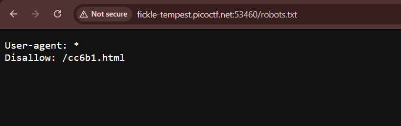
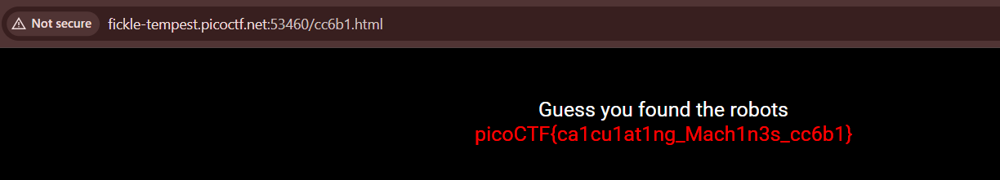

# picoCTF 2019 - Where are the robots

**Category:** Web Exploitation

## 1. Description

Đề bài: Can you find the robots?
Link bài lab: http://fickle-tempest.picoctf.net:53460/

## 2. Reconnaissance (Trinh sát)

Truy cập vào trang web, tôi nhận thấy tên bài là "Where are the robots", gợi ý đến file `robots.txt` - tiêu chuẩn dùng cho các bộ máy tìm kiếm (Google Bot).

Tôi kiểm tra file này bằng cách thêm đường dẫn `/robots.txt` vào URL.
Request: `GET /robots.txt`

**Kết quả:**
Server trả về nội dung file robots.txt và lộ ra một đường dẫn ẩn.

## 3. Vulnerability Analysis (Phân tích)

Trong nội dung file `robots.txt` có dòng `Disallow: /cc6b1.html`.
Đây là lỗi **Information Disclosure** (Lộ lọt thông tin). Quản trị viên cố tình giấu trang này đi nhưng lại ghi rõ địa chỉ của nó trong file công khai.

## 4. Exploitation (Khai thác)

Tôi truy cập trực tiếp vào đường dẫn bị ẩn vừa tìm được: `/cc6b1.html`

Trang web hiển thị Flag.

## 5. Result

**Flag:** picoCTF{ca1cu1at1ng_Mach1n3s_cc6b1}
