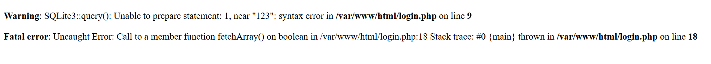

# picoCTF 2019 - Irish-Name-Repo 1

**Category:** Web Exploitation
**Tags:** SQL Injection, SQLi, Authentication Bypass

## 1. Description

> **Challenge:** Do you think you can log us in? Try to see if you can login!
> **Link:** http://fickle-tempest.picoctf.net:54840

## 2. Reconnaissance

Giao diện trang web khá đơn giản, bao gồm các hình ảnh và menu điều hướng.


Tôi truy cập vào trang **Admin Login** qua thanh menu. Tại đây có một form đăng nhập yêu cầu `Username` và `Password`.

Tôi thử kiểm tra phản hồi của server bằng cách nhập các giá trị ngẫu nhiên:

- **Input:** `test` / `test`
- **Output:** `Login failed`

Tiếp theo, tôi thử kiểm tra lỗi SQL Injection bằng cách nhập ký tự đặc biệt `'` vào trường `Username`.

- **Input:** `'`
- **Output:** Trang web trả về lỗi SQL query.



=> **Nhận định:** Việc server phản ứng lại với ký tự `'` chứng tỏ đầu vào của người dùng không được làm sạch (sanitize) và được đưa trực tiếp vào câu truy vấn database. Đây là dấu hiệu của lỗ hổng **SQL Injection**. Database có thể là **SQLite**.

## 3. Vulnerability Analysis

Dựa trên hành vi của ứng dụng, tôi giả định mã nguồn Backend xử lý việc đăng nhập có dạng truy vấn SQL như sau:

```sql
SELECT * FROM users WHERE username = '$username' AND password = '$password';
```

Trong câu lệnh SQL tiêu chuẩn:

Dấu `'` dùng để bao quanh chuỗi ký tự (string).

Dấu `--` là ký tự comment (chú thích), nó sẽ khiến database bỏ qua toàn bộ phần lệnh phía sau nó.

Mục tiêu của tôi là thực hiện tấn công Authentication Bypass (Vượt qua xác thực) bằng cách ngắt câu lệnh SQL ngay sau phần kiểm tra `username` và vô hiệu hóa phần kiểm tra `password`.

4. Exploitation
   Tôi sử dụng payload sau để đăng nhập với quyền admin: `admin' --`
   Phân tích Payload: Khi hệ thống ghép payload này vào câu truy vấn giả định, câu lệnh thực tế được gửi đến database sẽ là:
   `SELECT * FROM users WHERE username = 'admin' --' AND password = '$password';`

`admin`: Giá trị username muốn đăng nhập.

`'`: Đóng chuỗi string của trường username.

`--`: Biến toàn bộ đoạn `AND password = ...` phía sau thành comment (vô nghĩa).

Kết quả là câu lệnh trở thành `SELECT * FROM users WHERE username = 'admin'`. Điều kiện này luôn đúng.

Thực hiện: Nhập payload vào ô `username` và `password` bất kỳ.

## 5. Result

**Flag:** `picoCTF{s0m3_SQL_85832275}`

## 6. Remediation (Khắc phục)

Để ngăn chặn lỗi SQL Injection tương tự, nhà phát triển cần tuân thủ nguyên tắc **"Never trust user input"**. Cụ thể:

    1.Sử dụng **Prepared Statements** (Câu lệnh chuẩn bị): Thay vì nối chuỗi trực tiếp, hãy sử dụng **Parameterized Queries**. Database sẽ coi đầu vào của người dùng chỉ là dữ liệu thuần túy, không phải là mã lệnh thực thi.

    Ví dụ (PHP/PDO):

```php
$stmt = $pdo->prepare('SELECT * FROM users WHERE username = :username AND password = :password');
$stmt->execute(['username' => $input_user, 'password' => $input_pass]);
```

    2.**Input Validation**: Kiểm tra và lọc đầu vào để đảm bảo đúng định dạng mong đợi (ví dụ: chỉ cho phép ký tự chữ và số).
